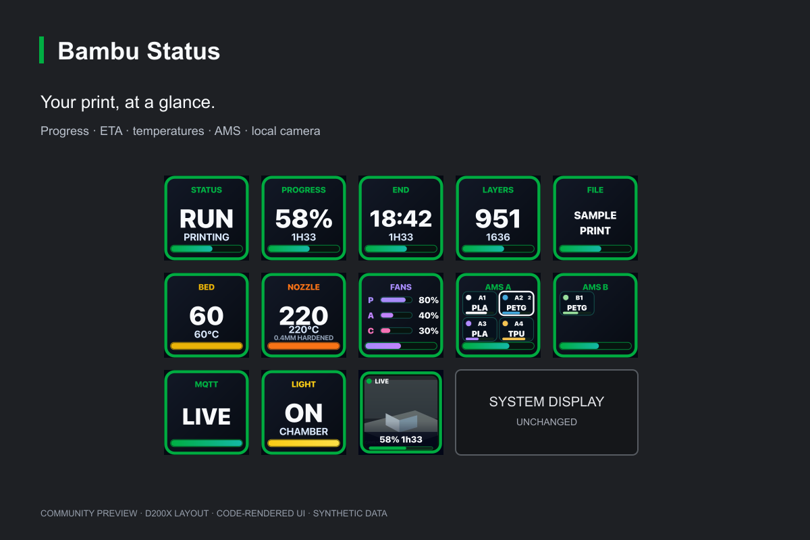
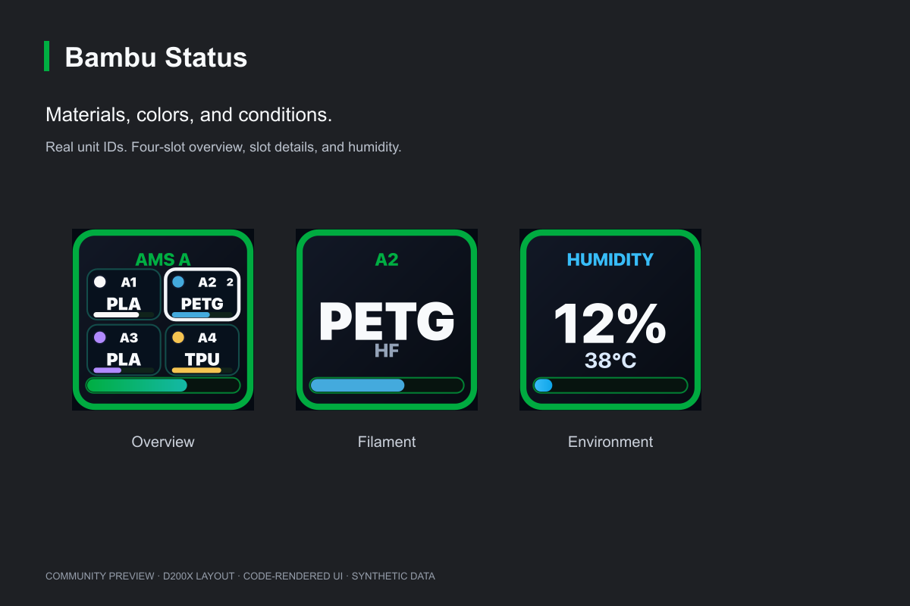
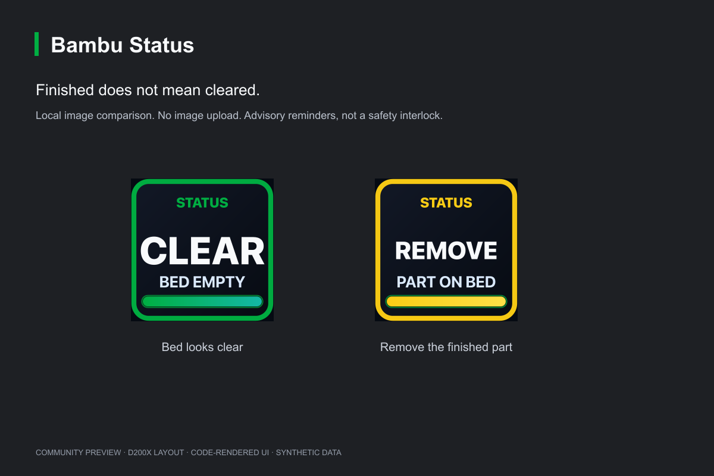

# Bambu Status

**Ulanzi D200X 上的 Bambu Lab 本地监控与取件提醒。**

把进度、预计结束时间、温度、AMS 和实时画面留在桌面上。按一下切换信息，长按进入 13 格画面；打印结束后，用本地检测提醒盘面可能还留着成品。

[English](README.md) · [下载 0.4.0](https://github.com/Cisanotheraccount/bambu-status/releases/tag/v0.4.0) · [兼容情况](docs/COMPATIBILITY.md)

## 0.4.0 社区预览版

这是社区项目，不是 Ulanzi 或 Bambu Lab 官方产品。P1S、macOS、D200X 是原项目的开发与使用基础；公开配对流程及 Windows 路径是新改造。自动化测试不等于所有机型、固件与 Windows 实物环境均已验收。

## 安装

1. 在 GitHub Release 下载 macOS universal 或 Windows 的 `.ulanziPlugin.zip`。运行依赖已包含，普通用户不需要安装 Node.js、npm 或 Xcode。
2. 使用 Ulanzi Studio 的插件导入功能安装。若当前 Studio 版本要求目录，解压并导入里面的 `.ulanziPlugin` 文件夹，不要覆盖已有页面。
3. 把一个 Bambu Status 组件放到空闲按键，打开设置，点「查找」，选打印机，首次输入 LAN Access Code，再点「配对打印机」。发现不到时可手动填 IP 与序列号。
4. 按需添加组件，或主动导入 Release 中独立的 **D200X Profile**。它不含打印机身份，提供 13 个按键；具体 Studio 版本的导入行为仍需验收，不会自动安装覆盖现有页面。[推荐排布](docs/SETUP.md#recommended-layout)
5. 需要取件提醒时，确认停止打印且盘面为空，再分别采集开灯、关灯参考图；采集按钮不会替你切灯。

电脑与 Ulanzi Studio 需要持续运行。局域网发现可能受 VLAN、VPN、无线客户端隔离及固件访问规则影响；本插件不会偷偷关闭云连接、开启 LAN Only 或 Developer Mode，也不需要登录 Bambu 云账号。

## 功能

| 组件 | 内容与交互 |
| --- | --- |
| Status | 状态与可读阶段；非打印时按一下进行盘面检测 |
| Progress | 百分比；按一下切换剩余时间与首次观察的预计结束时刻 |
| ETA | 默认显示 24 小时制完成时刻，跨日有 +1D / +2D；按一下交换主副信息 |
| Layers | 当前层数白色大字、总层数较小浅灰字，不带斜杠 |
| Bed / Nozzle | 当前温度、目标温度及有报告的盘面/喷嘴详情 |
| Fans | 三个报告百分比与平均条，不是实测 RPM 或瓦数 |
| AMS | 四盘总览、逐盘材质与余量色条、湿度温度；短按翻页，长按回首页 |
| File / Errors / Connection | 文件名、有限错误释义、MQTT 状态 |
| Light | 仓内灯开关，等待打印机返回状态确认 |
| Camera | 短按预览开关；长按约 0.8 秒拼成 L 形 13 格画面；参与按键长按退出 |
| Custom Tile | 自选显示内容，另可显示 WiFi 与更新距今时间 |

AMS 列表按报告生成、按真实 ID 绑定。余量是估计，不是剩余克数；只有湿度等级的设备不会被编造成真实百分比。最初 ETA 保存的是首次观察到的时刻估计；中途连接不能还原真正开打时的预测。

## 本地盘面检测

使用本机参考图、像素比较及 macOS 上可用的 Apple Vision 特征匹配。Windows 使用跨平台像素路径。启动且不在打印时、观察到打印结束后各检测一次，也可按 Status 主动检测。运行、准备与暂停的打印任务跳过检测。

手动检测必须等到新的视频帧；失败显示错误，不复用旧空床结果。黄色 REMOVE 表示可能需要取件，绿色 CLEAR 表示上次检测看起来为空。灯光、盘面高度、阴影、小物件及透明材料仍可能误报或漏报。

**这是辅助提醒，不是安全联锁。下一次打印前仍要亲自检查盘面。**

## 隐私与边界

- 不调用云端图像模型，不上传画面，不消耗外部模型 API token。
- Access Code 通过 macOS Keychain / Windows DPAPI 保护，普通设置不保存它。
- 每台打印机有独立参考目录；缓存是最近三张采样图，不是三次打印全套照片。
- 原生自签名证书场景需要受信任局域网，不要把打印机服务暴露在公网。
- 只保留仓内灯控制；Stop、校准、RFID 重读、切片、温度和运动控制均不提供。
- X1 的 RTSP 画面需要用户提供 FFmpeg，安装包不包含；缺少它不影响普通监控。

开发、兼容、数据目录与故障排查见 [English README](README.md) 和 `docs/`。源码采用 MIT；Ulanzi SDK 保留 Apache-2.0。此版本不会自动覆盖原有页面或迁移旧版私人参考图。
